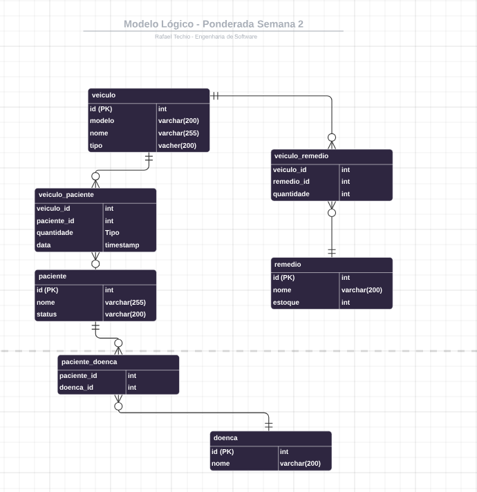
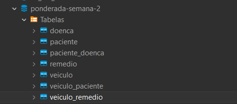
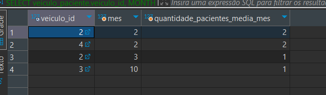

# M6-Ponderada-Semana2-BD
Rafael Techio

## Modelo Lógico
O diagrama do banco de dados busca solucionar a situação proposta pelo gerenciamento dos dados de veículos, pacientes, remédios e doenças.


## Resultado

### Criação do banco de dados
Resultado após a execução das criações de tabelas:


Modelo físico:
```
-- `ponderada-semana-2`.doenca definition

CREATE TABLE `doenca` (
  `id` int NOT NULL AUTO_INCREMENT,
  `nome` varchar(100) DEFAULT NULL,
  PRIMARY KEY (`id`)
) ENGINE=InnoDB AUTO_INCREMENT=6 DEFAULT CHARSET=utf8mb4 COLLATE=utf8mb4_0900_ai_ci;


-- `ponderada-semana-2`.paciente definition

CREATE TABLE `paciente` (
  `id` int NOT NULL AUTO_INCREMENT,
  `nome` varchar(100) DEFAULT NULL,
  `status` varchar(100) DEFAULT NULL,
  PRIMARY KEY (`id`)
) ENGINE=InnoDB AUTO_INCREMENT=6 DEFAULT CHARSET=utf8mb4 COLLATE=utf8mb4_0900_ai_ci;


-- `ponderada-semana-2`.remedio definition

CREATE TABLE `remedio` (
  `id` int NOT NULL AUTO_INCREMENT,
  `nome` varchar(100) DEFAULT NULL,
  `estoque` int DEFAULT NULL,
  PRIMARY KEY (`id`)
) ENGINE=InnoDB AUTO_INCREMENT=4 DEFAULT CHARSET=utf8mb4 COLLATE=utf8mb4_0900_ai_ci;


-- `ponderada-semana-2`.veiculo definition

CREATE TABLE `veiculo` (
  `id` int NOT NULL AUTO_INCREMENT,
  `modelo` varchar(100) CHARACTER SET utf8mb4 COLLATE utf8mb4_0900_ai_ci DEFAULT NULL,
  `nome` varchar(100) CHARACTER SET utf8mb4 COLLATE utf8mb4_0900_ai_ci DEFAULT NULL,
  `tipo` varchar(100) DEFAULT NULL,
  PRIMARY KEY (`id`)
) ENGINE=InnoDB AUTO_INCREMENT=5 DEFAULT CHARSET=utf8mb4 COLLATE=utf8mb4_0900_ai_ci;


-- `ponderada-semana-2`.paciente_doenca definition

CREATE TABLE `paciente_doenca` (
  `paciente_id` int DEFAULT NULL,
  `doenca_id` int DEFAULT NULL,
  KEY `paciente_doenca_FK` (`paciente_id`),
  KEY `paciente_doenca_FK_1` (`doenca_id`),
  CONSTRAINT `paciente_doenca_FK` FOREIGN KEY (`paciente_id`) REFERENCES `paciente` (`id`) ON UPDATE CASCADE,
  CONSTRAINT `paciente_doenca_FK_1` FOREIGN KEY (`doenca_id`) REFERENCES `doenca` (`id`) ON UPDATE CASCADE
) ENGINE=InnoDB DEFAULT CHARSET=utf8mb4 COLLATE=utf8mb4_0900_ai_ci;


-- `ponderada-semana-2`.veiculo_paciente definition

CREATE TABLE `veiculo_paciente` (
  `veiculo_id` int DEFAULT NULL,
  `paciente_id` int DEFAULT NULL,
  KEY `veiculo_paciente_FK` (`veiculo_id`),
  KEY `veiculo_paciente_FK_1` (`paciente_id`),
  CONSTRAINT `veiculo_paciente_FK` FOREIGN KEY (`veiculo_id`) REFERENCES `veiculo` (`id`) ON DELETE CASCADE ON UPDATE CASCADE,
  CONSTRAINT `veiculo_paciente_FK_1` FOREIGN KEY (`paciente_id`) REFERENCES `paciente` (`id`) ON UPDATE CASCADE
) ENGINE=InnoDB DEFAULT CHARSET=utf8mb4 COLLATE=utf8mb4_0900_ai_ci;


-- `ponderada-semana-2`.veiculo_remedio definition

CREATE TABLE `veiculo_remedio` (
  `veiculo_id` int DEFAULT NULL,
  `remedio_id` int DEFAULT NULL,
  `quantidade` int DEFAULT NULL,
  KEY `veiculo_remedio_FK` (`veiculo_id`),
  KEY `veiculo_remedio_FK_1` (`remedio_id`),
  CONSTRAINT `veiculo_remedio_FK` FOREIGN KEY (`veiculo_id`) REFERENCES `veiculo` (`id`) ON UPDATE CASCADE,
  CONSTRAINT `veiculo_remedio_FK_1` FOREIGN KEY (`remedio_id`) REFERENCES `remedio` (`id`) ON UPDATE CASCADE
) ENGINE=InnoDB DEFAULT CHARSET=utf8mb4 COLLATE=utf8mb4_0900_ai_ci;
```

### Query de consulta
```
SELECT 
	veiculo_paciente.veiculo_id, 
	CONCAT(YEAR(veiculo_paciente.`data`), "-", MONTH(veiculo_paciente.`data`)) as `data`, 
	COUNT(veiculo_paciente.paciente_id) as 'quantidade_pacientes'
FROM veiculo_paciente
GROUP BY YEAR(veiculo_paciente.`data`), MONTH(veiculo_paciente.`data`), veiculo_paciente.veiculo_id 
```

Resultado:


## Links
Endpoint da RDS: database-1.cjen6h8axap6.us-east-1.rds.amazonaws.com

A senha e outras informações de acesso estão no card da ponderada.
